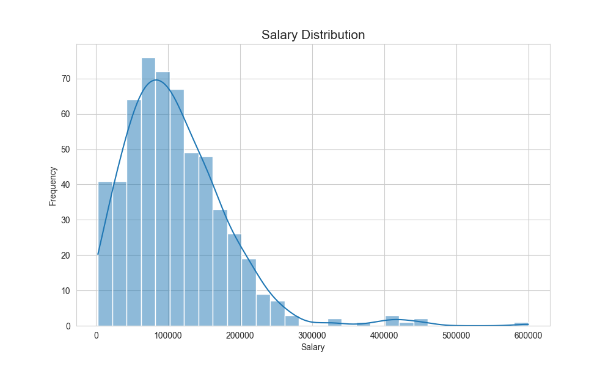
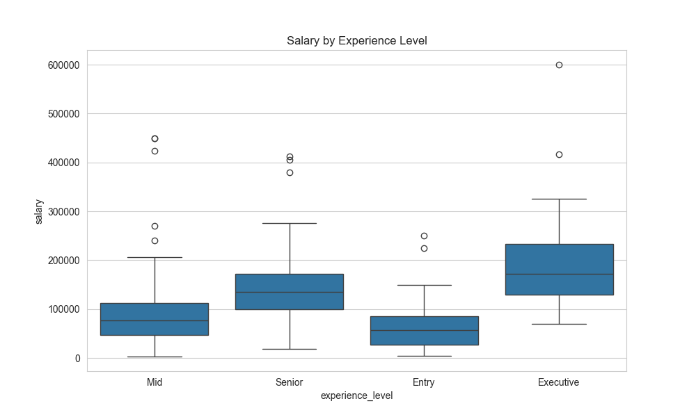
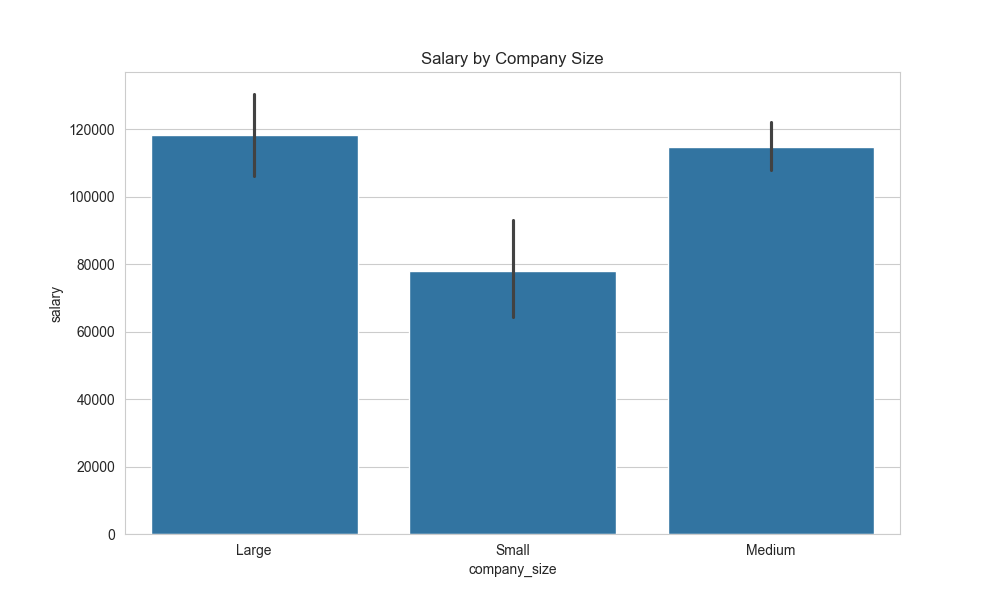
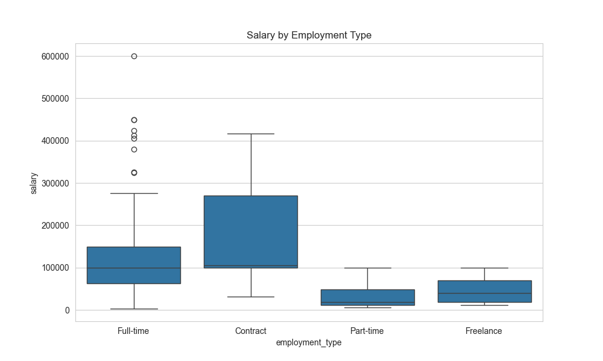
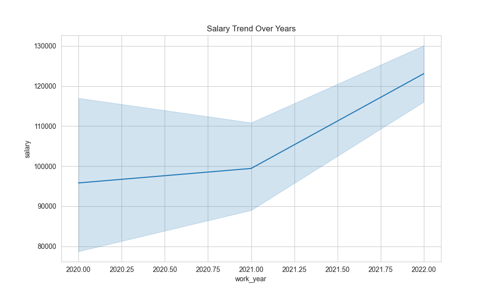
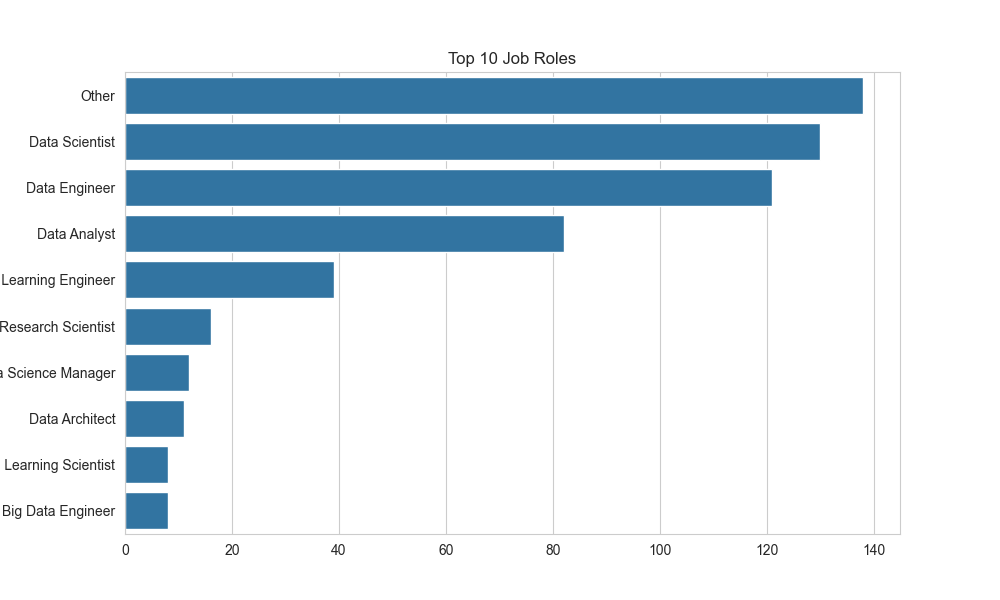
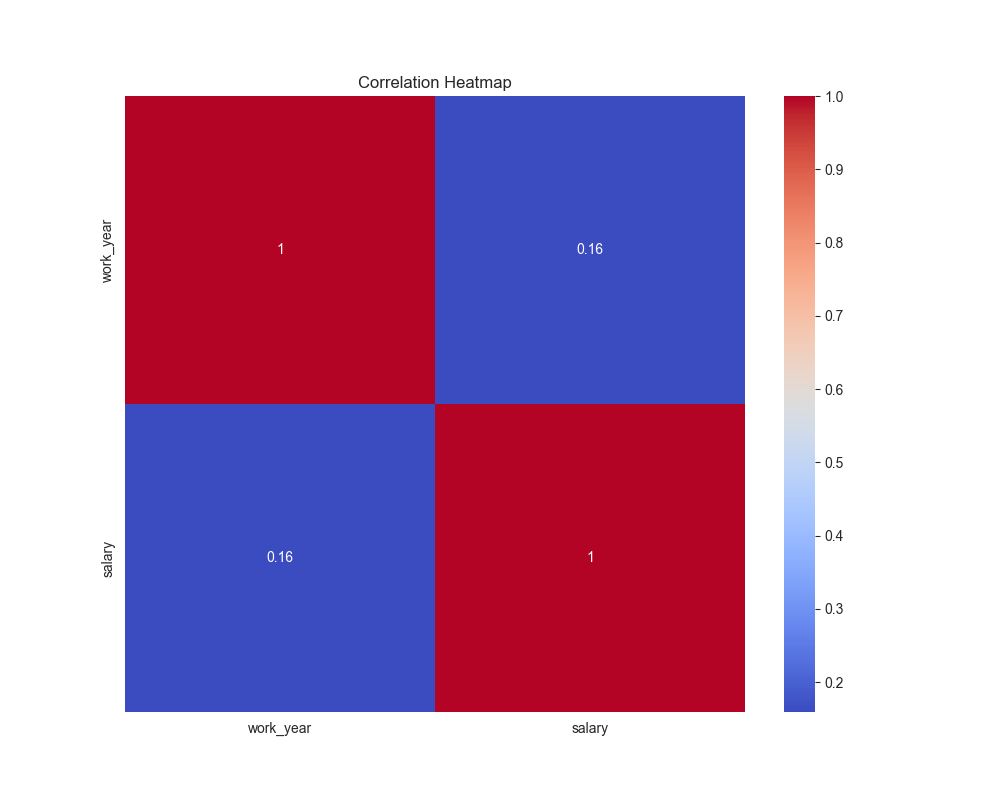

# 💼 Data Science Job Salary Analysis & Prediction

---

## 📌 Project Overview

This project performs **Exploratory Data Analysis (EDA)** and **Machine Learning** on a real-world dataset of data science job salaries.
The objective is to analyze salary trends and build a predictive model to estimate salaries based on job-related features.

---

## 🎯 Objectives

* Analyze salary distribution in data science roles
* Identify key factors affecting salary
* Compare salaries across experience levels, company size, and job types
* Build a machine learning model for salary prediction

---

## 🛠️ Tools & Technologies

* Python
* Pandas, NumPy
* Matplotlib, Seaborn
* Scikit-learn

---

## 📊 Dataset Features

* Work Year
* Experience Level
* Employment Type
* Job Title
* Salary (USD)
* Company Location
* Company Size
* Remote Ratio

---

## 🔍 Exploratory Data Analysis (EDA)

### 📈 Salary Distribution

➡️ Most salaries are concentrated in the mid-range, with some high-paying outliers.

---

### 👨‍💼 Salary vs Experience Level

➡️ Salaries increase significantly with experience level.

---

### 🏢 Salary vs Company Size

➡️ Large companies generally offer higher salaries.

---

### 💼 Salary vs Employment Type

➡️ Full-time roles dominate and provide stable compensation.

---

### 📊 Salary Trend Over Years

➡️ Salaries show an increasing trend over time.

---

### 🔝 Top Job Roles

➡️ Data Scientist and ML Engineer roles are among the most common.

---

### 🔥 Correlation Heatmap

➡️ Experience level and company size have a noticeable impact on salary.

---

## 🤖 Machine Learning

### Models Used

* Linear Regression (Baseline Model)
* Random Forest Regressor (Final Model)

---

### 📊 Model Performance

* **MAE (Mean Absolute Error):** ~31,455
* **R² Score:** ~0.43

---

## 🧠 Key Insights

* Experience level is the most important factor affecting salary
* Job role and company location significantly influence salary
* Large companies tend to pay higher salaries
* Remote jobs offer competitive compensation
* Salary trends have increased over recent years

---

## 🔧 Improvements Made

* Data cleaning and preprocessing
* Handling missing values
* Feature engineering
* Reducing high-cardinality features (job role, location)
* Model tuning using Random Forest

---

## 📌 Conclusion

This project demonstrates how **EDA and Machine Learning** can be used to analyze real-world salary data and build predictive models.
It highlights the importance of feature selection and model tuning in improving performance.

---

## 🚀 Future Improvements

* Use advanced models (XGBoost, LightGBM)
* Perform hyperparameter tuning
* Deploy as a web application

---

## 👨‍💻 Author

**Rushikesh Maishmale**
